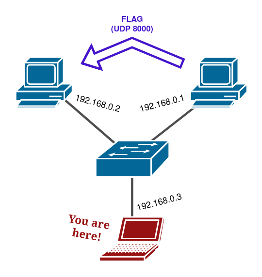

# MetaCTF 2021
## Challenge (50pts)
### Description: 
>192.168.0.1 is periodically (once every 4 seconds) sending the flag to 192.168.0.2 over UDP port 8000. Go get it.
ssh ctf-1@host.cg21.metaproblems.com -p 7000
If you get an SSH host key error, consider using
ssh -o "UserKnownHostsFile=/dev/null" -o "StrictHostKeyChecking=no" ctf-1@host.cg21.metaproblems.com -p 7000

Additionally, a network map was provided, shown below:

### Step 1 - Changing the IP address
To solve Interception I, we used `ifconfig eth0 192.168.0.2` which changed our local IP address to the IP address that the flag was being sent to. 
We initially thought this challenge had to do with ARP poisioning, however the tools and permissions available on the machine would not let us use `arping` to set a different source (in this case, 192.168.0.2).

### Step 2 - Capturing traffic with TCPDump:
Next, we had to monitor incoming UDP traffic to catch the flag. This was done with tcpdump, one of the tools available on the machine. 
To do this, we used `tcpdump -a -vvvvv` to monitor incoming traffic on the device. At this point, the flag was found.

  
 Flag Spoiler 

  MetaCTF{addr3s5_r3s0lut1on_pwn4g3}

## Learning Takeaways
At first, we looked too deeply into how we could potentially attack the sending machine (192.168.0.1) with ARP cache poisioning. 
Once we figured out we could take over the IP address with just ifconfig, capturing the flag was relatively simple. Sometimes a simple solution is the best one.
