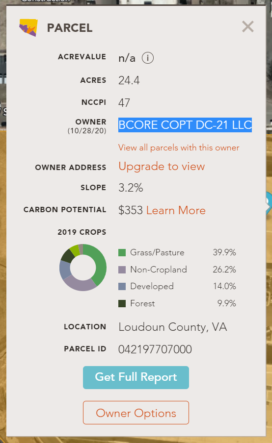

# MetaCTF 2021
## Who owns the cloud? (225pts)
### Description: 
>In conducting Open Source Intelligence (OSINT), we act as sort of "cyber detectives," finding little tidbits of information and connecting them to put together a more complete understanding of something. 
>Take this [datacenter](https://goo.gl/maps/jacryehbW6NCgD9d9) for example. Usually it is very easy to figure out what company owns a building - especially when it's a giant facility and the company puts their logo on it. But what if the obvious visual clues aren't there? Dig deeper and see if you can find the company that *directly* owns this piece of land. You'll want to submit the name of the company as the flag.

### Step 1 - Baseline OSINT:
We need to determine the exact address that the datacenter is located since Google Maps often guesses the number that comes before an address. 
When looking at the street view in google maps, we see that there is a number written on the datacenter '45295', so the address for the datacenter is
> 45295 W Severn Way, Sterling, VA 20166

## Step 2 - Finding the Landowner:
Given the right address for the datacenter, we can do some simple Google sleuthing to determine who owns the land. 
The first results that come up when searching for the address mention AWS, however it is common for businesses to lease land rather than owning it directly, so we wanted to dig a bit deeper.
[One result](https://www.loudoun.gov/DocumentCenter/View/151730/LD-Applications-Received-June-06-01-2019) that was found appeared to be a public document from https://www.loudoun.gov/ , the county where the datacenter is located. 
However, this was a rather old document and the answer was not found here. A google search for "find land owner in virginia" linked us to an online tool called [AcreValue](https://www.acrevalue.com/plat-map/VA/). 
At this point, we were able to enter the address we previously found in Step 1, register for an account to view who the Owner was, and the flag was found.

## Learning Takeaways
For this challenge, looking at information from multiple sources ended up being what found the new landowner. We tried looking directly at state and county websites, however it appeared that getting information from those sources would have costed money and taken a lot of time. OSINT shouldn't stop at just one or two sources. 
